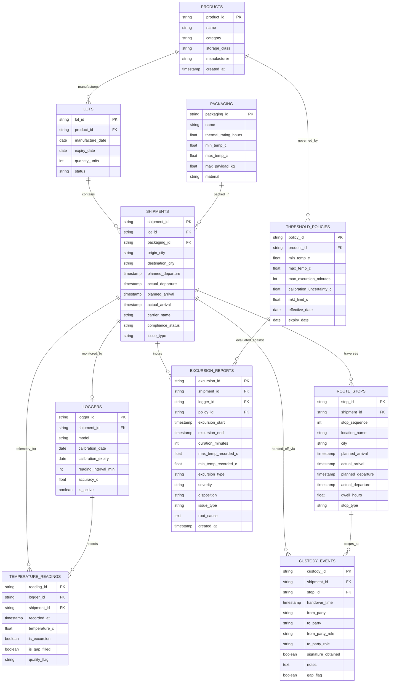

# Cold Chain Compliance Platform — Entity Relationship Diagram

## Mermaid ER Diagram

```mermaid
erDiagram
    PRODUCTS ||--o{ LOTS : "manufactures"
    PRODUCTS ||--o{ THRESHOLD_POLICIES : "governed_by"
    LOTS ||--o{ SHIPMENTS : "contains"
    PACKAGING ||--o{ SHIPMENTS : "packed_in"
    SHIPMENTS ||--o| LOGGERS : "monitored_by"
    SHIPMENTS ||--o{ ROUTE_STOPS : "traverses"
    SHIPMENTS ||--o{ CUSTODY_EVENTS : "handed_off_via"
    SHIPMENTS ||--o{ TEMPERATURE_READINGS : "telemetry_for"
    LOGGERS ||--o{ TEMPERATURE_READINGS : "records"
    ROUTE_STOPS ||--o{ CUSTODY_EVENTS : "occurs_at"
    SHIPMENTS ||--o{ EXCURSION_REPORTS : "incurs"
    THRESHOLD_POLICIES ||--o{ EXCURSION_REPORTS : "evaluated_against"

    PRODUCTS {
        string product_id PK
        string name
        string category
        string storage_class
        string manufacturer
        timestamp created_at
    }

    PACKAGING {
        string packaging_id PK
        string name
        float thermal_rating_hours
        float min_temp_c
        float max_temp_c
        float max_payload_kg
        string material
    }

    THRESHOLD_POLICIES {
        string policy_id PK
        string product_id FK
        float min_temp_c
        float max_temp_c
        int max_excursion_minutes
        float calibration_uncertainty_c
        float mkt_limit_c
        date effective_date
        date expiry_date
    }

    LOTS {
        string lot_id PK
        string product_id FK
        date manufacture_date
        date expiry_date
        int quantity_units
        string status
    }

    SHIPMENTS {
        string shipment_id PK
        string lot_id FK
        string packaging_id FK
        string origin_city
        string destination_city
        timestamp planned_departure
        timestamp actual_departure
        timestamp planned_arrival
        timestamp actual_arrival
        string carrier_name
        string compliance_status
        string issue_type
    }

    LOGGERS {
        string logger_id PK
        string shipment_id FK
        string model
        date calibration_date
        date calibration_expiry
        int reading_interval_min
        float accuracy_c
        boolean is_active
    }

    ROUTE_STOPS {
        string stop_id PK
        string shipment_id FK
        int stop_sequence
        string location_name
        string city
        timestamp planned_arrival
        timestamp actual_arrival
        timestamp planned_departure
        timestamp actual_departure
        float dwell_hours
        string stop_type
    }

    CUSTODY_EVENTS {
        string custody_id PK
        string shipment_id FK
        string stop_id FK
        timestamp handover_time
        string from_party
        string to_party
        string from_party_role
        string to_party_role
        boolean signature_obtained
        text notes
        boolean gap_flag
    }

    TEMPERATURE_READINGS {
        string reading_id PK
        string logger_id FK
        string shipment_id FK
        timestamp recorded_at
        float temperature_c
        boolean is_excursion
        boolean is_gap_filled
        string quality_flag
    }

    EXCURSION_REPORTS {
        string excursion_id PK
        string shipment_id FK
        string logger_id FK
        string policy_id FK
        timestamp excursion_start
        timestamp excursion_end
        int duration_minutes
        float max_temp_recorded_c
        float min_temp_recorded_c
        string excursion_type
        string severity
        string disposition
        string issue_type
        text root_cause
        timestamp created_at
    }
```

